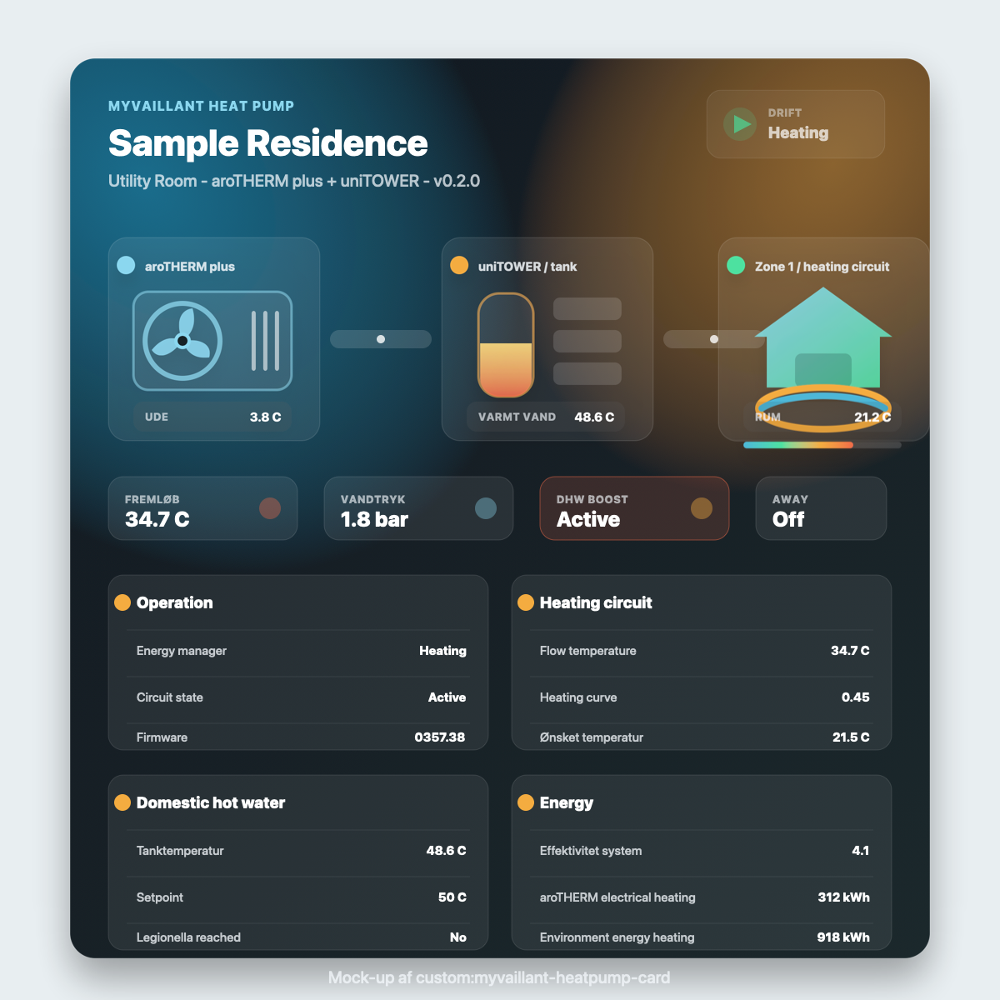

# MyVaillant Heat Pump Card

An infographic Lovelace custom card for Vaillant aroTHERM plus / uniTOWER heat pump systems using entities from the Home Assistant `myVAILLANT` integration.

The card shows a modern air-to-water heat pump setup with an outdoor unit, animated energy flow, indoor tower/tank, heating circuit, live operating values and grouped system details.



## Features

- Animated heat pump infographic with outdoor unit, uniTOWER/tank and heating zone.
- Responsive layout for both narrow and wide Home Assistant sections views.
- Visual Lovelace editor with entity pickers, so you do not need to edit YAML for normal setup.
- Optional YAML configuration for advanced users.
- Empty fields are hidden automatically unless `show_empty` is enabled.

## Installation with HACS

Home Assistant 2024.11 or newer is recommended because the card includes sections view sizing support.

1. Open Home Assistant.
2. Go to `HACS` -> `Custom repositories`.
3. Add this repository URL:

```text
https://github.com/msamsing/myvaillant-heatpump-card
```

4. Select category `Dashboard`.
5. Install `MyVaillant Heat Pump Card`.
6. Refresh the browser.

If HACS does not add the dashboard resource automatically, add it manually:

```yaml
url: /hacsfiles/myvaillant-heatpump-card/myvaillant-heatpump-card.js
type: module
```

## Visual Setup

After installation:

1. Edit your dashboard.
2. Add a new card.
3. Search for `MyVaillant Heat Pump Card`.
4. Use the visual editor to type entity IDs manually or choose them from the entity picker dropdowns.

You can leave fields empty. The card will only show rows for configured entities by default.

## Sections View Sizing

The card declares grid options for Home Assistant sections view:

- Default width: 12 columns.
- Minimum width: 6 columns.
- Maximum width: 12 columns.
- Height is content-driven to avoid clipping when many entities are configured.

The layout uses container queries, so it adapts to the actual card width. In a wide section it shows the full horizontal infographic. In a narrower section it stacks the heat pump components vertically and keeps the detailed panels readable.

## YAML Example

The visual editor is the recommended setup path, but YAML is also supported. Replace these entity IDs with the actual IDs from `Developer Tools` -> `States`.

```yaml
type: custom:myvaillant-heatpump-card
title: Sample Residence
subtitle: Utility Room · aroTHERM plus + uniTOWER
entities:
  outdoor_temperature: sensor.sample_home_outdoor_temperature
  system_water_pressure: sensor.sample_home_system_water_pressure
  energy_manager_state: sensor.sample_home_energy_manager_state
  firmware_version: sensor.sample_home_firmware_version

  circuit_state: sensor.sample_home_circuit_0_state
  current_flow_temperature: sensor.sample_home_circuit_0_current_flow_temperature
  heating_curve: sensor.sample_home_circuit_0_heating_curve
  min_flow_temperature_setpoint: sensor.sample_home_circuit_0_min_flow_temperature_setpoint
  heat_demand_limited_by_outside_temperature: binary_sensor.sample_home_circuit_0_heat_demand_limited_by_outside_temperature

  zone_current_temperature: sensor.sample_home_zone_zone_1_circuit_0_current_temperature
  zone_humidity: sensor.sample_home_zone_zone_1_circuit_0_humidity
  zone_desired_temperature: sensor.sample_home_zone_zone_1_circuit_0_desired_temperature
  zone_desired_heating_temperature: sensor.sample_home_zone_zone_1_circuit_0_desired_heating_temperature
  zone_desired_cooling_temperature: sensor.sample_home_zone_zone_1_circuit_0_desired_cooling_temperature
  zone_heating_operating_mode: sensor.sample_home_zone_zone_1_circuit_0_heating_operating_mode
  zone_special_function: sensor.sample_home_zone_zone_1_circuit_0_current_special_function
  quick_veto_duration: sensor.sample_home_zone_zone_1_circuit_0_quick_veto_duration
  ventilation_boost: switch.sample_home_zone_zone_1_circuit_0_ventilation_boost

  dhw_tank_temperature: sensor.sample_home_domestic_hot_water_0_tank_temperature
  dhw_setpoint: sensor.sample_home_domestic_hot_water_0_setpoint
  dhw_operation_mode: sensor.sample_home_domestic_hot_water_0_operation_mode
  dhw_special_function: sensor.sample_home_domestic_hot_water_0_current_special_function
  dhw_boost: switch.sample_home_domestic_hot_water_0_boost
  legionella_temperature_reached: binary_sensor.sample_home_domestic_hot_water_0_legionella_protection_temperature_reached

  heating_energy_efficiency: sensor.sample_home_heating_energy_efficiency
  arotherm_heating_energy_efficiency: sensor.sample_home_device_0_arotherm_plus_heating_energy_efficiency
  arotherm_consumed_electrical_energy_dhw: sensor.sample_home_device_0_arotherm_plus_consumed_electrical_energy_domestic_hot_water
  arotherm_consumed_electrical_energy_heating: sensor.sample_home_device_0_arotherm_plus_consumed_electrical_energy_heating
  arotherm_earned_environment_energy_dhw: sensor.sample_home_device_0_arotherm_plus_earned_environment_energy_domestic_hot_water
  arotherm_earned_environment_energy_heating: sensor.sample_home_device_0_arotherm_plus_earned_environment_energy_heating
  arotherm_heat_generated_heating: sensor.sample_home_device_0_arotherm_plus_heat_generated_heating
  arotherm_heat_generated_dhw: sensor.sample_home_device_0_arotherm_plus_heat_generated_domestic_hot_water

  unitower_heating_energy_efficiency: sensor.sample_home_device_1_unitower_heating_energy_efficiency
  unitower_consumed_electrical_energy_dhw: sensor.sample_home_device_1_unitower_consumed_electrical_energy_domestic_hot_water
  unitower_consumed_electrical_energy_heating: sensor.sample_home_device_1_unitower_consumed_electrical_energy_heating
  unitower_heat_generated_heating: sensor.sample_home_device_1_unitower_heat_generated_heating
  unitower_heat_generated_dhw: sensor.sample_home_device_1_unitower_heat_generated_domestic_hot_water

  away_mode: switch.sample_home_away_mode
  away_mode_start_date: sensor.sample_home_away_mode_start_date
  away_mode_end_date: sensor.sample_home_away_mode_end_date
  holiday_duration_remaining: sensor.sample_home_holiday_duration_remaining
```

## Notes About Entity IDs

Home Assistant may expose some `myVAILLANT` values as `sensor`, `binary_sensor`, `switch`, `select`, `number` or another domain depending on the entity. This card does not require a specific domain. Choose the entity that represents the value you want to display.

If a value is not available in your system, leave that field empty.
